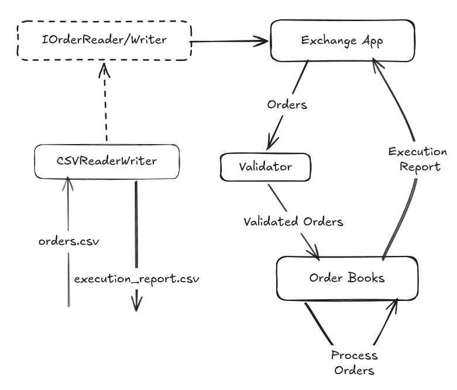
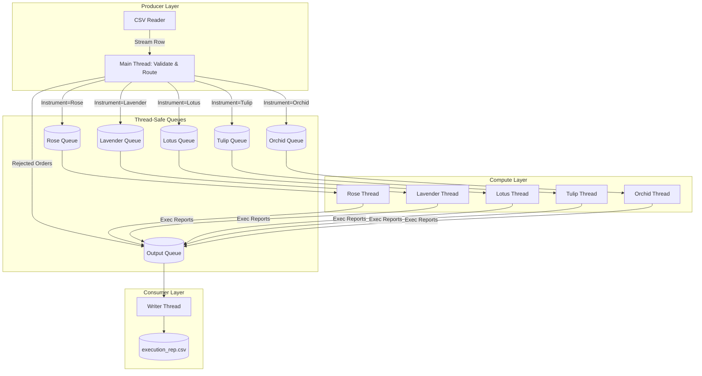

# LSEG Flower Exchange Matching Engine

A high-performance, strictly validated, C++17 order matching engine built for the LSEG Flower Exchange project. It implements a Central Limit Order Book (CLOB) capable of processing massive datasets with high throughput and extremely low latency.

## Features

* **Strict Adherence to SOLID Principles:** Fully decoupled I/O via `IOrderReader` and `IExecutionWriter` interfaces.

* **Algorithmic Efficiency:** Achieves $O(1)$ time priority and $O(\log N)$ price priority using a composite `std::map` and `std::queue` data structure.
* **Zero-Copy Ingestion:** Utilizes `std::move` semantics and native variable extraction from CSVs to eliminate intermediate string allocations.
* **Multithreaded Streaming Pipeline:** A highly optimized Producer-Consumer architecture using lock-free compute nodes to maximize CPU utilization.

---

## System Architecture

### High-Level Design

The core matching engine is completely isolated from the I/O layer. The `ExchangeApp` orchestrates the flow of data but relies on abstract interfaces to fetch orders and dispatch reports.



### Multithreaded Streaming Model

To process massive files without memory bloat or startup latency, the engine uses a streaming Producer-Consumer model.

* Producer Thread (Main): Streams the CSV row-by-row, strictly validates the order, sequentially assigns the ordX ID to avoid atomic bottlenecks, and pushes the object to the correct instrument queue.

* Compute Threads (Workers): 5 dedicated threads, one for each flower type. Because each thread owns a specific OrderBook, no internal locks are required during the matching process, ensuring maximum throughput.

* Consumer Thread (Writer): A single background thread that collects all resulting execution reports and streams them out to the final CSV file.



## Building and Running

### Prerequisites

* CMake 3.10 or higher

* A C++17 compatible compiler (e.g., GCC or Clang)

### Build Instructions

Run the following commands from the root directory of the project:

```bash
mkdir -p build
cd build
cmake -DCMAKE_BUILD_TYPE=Release ..
make
```

### Execution

The application accepts optional command-line arguments for the input and output file paths. If none are provided, it defaults to the data/ folder.

```bash
# Using default paths (data/orders.csv -> data/execution_rep.csv)
./flower_exchange

# Using custom paths
./flower_exchange path/to/input.csv path/to/output.csv
```

## Testing and Benchmarking

To test the speed and multi-threading capabilities of the engine, use the included Python script to generate a large dataset with mixed valid and invalid orders:

```bash
python3 generate_test_data.py
./flower_exchange data/order_test.csv data/execution_rep.csv
```
